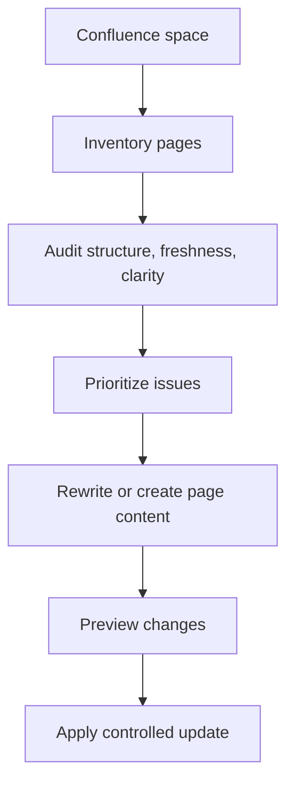

# Confluence Content Manager Skill


An AI-assisted documentation operations skill for auditing, standardizing, creating, and maintaining Confluence spaces at scale. It combines editorial judgment with API automation so documentation quality can be measured and improved systematically.

## Why It Matters

Documentation debt slows analytics teams down: stale pages, duplicated context, unclear ownership, and inconsistent templates make it harder to trust data products. This skill turns that problem into a repeatable workflow with inventory, quality checks, rewrite guidance, and controlled page updates.

| Business value | Technical value |
| --- | --- |
| Faster onboarding and cleaner knowledge bases | Confluence API client for inventory, audit, create, and update operations |
| More trustworthy analytics documentation | Template validation and stale-page detection |
| Less manual documentation maintenance | Repeatable CLI workflows for space audits and page fixes |
| Better governance without heavy process | Editorial standards encoded as reusable references |

## What It Can Do

- Inventory a Confluence space and collect page metadata.
- Identify stale, incomplete, malformed, unclear, or likely duplicate pages.
- Apply a consistent editorial template while preserving useful context.
- Create new documentation pages from structured inputs.
- Update existing pages through controlled API calls.
- Standardize analytics documentation branches using domain-specific rules.

## Workflow



## Repository Structure

```text
.
|-- SKILL.md
|-- agents/openai.yaml
|-- references/
|   |-- data-domains-standard.md
|   `-- editorial-standard.md
`-- scripts/confluence_manager.py
```

## Example Commands

```bash
python3 scripts/confluence_manager.py list-spaces
python3 scripts/confluence_manager.py audit-space --space "Analytics Documentation Team"
python3 scripts/confluence_manager.py fix-docs --space DOCS --dry-run
python3 scripts/confluence_manager.py update-page --page-id 123456 --body-file /tmp/page.md
```

## Design Principles

- Preserve valid business knowledge before rewriting.
- Separate audit, preview, and write operations.
- Prefer structured editorial standards over one-off edits.
- Treat credentials and page content as sensitive operational data.
- Report documentation health in a format leaders can scan quickly.

## Skills Demonstrated

`Confluence REST API`  -  `documentation governance`  -  `Python automation`  -  `content operations`  -  `knowledge management`  -  `AI-assisted editing`  -  `workflow design`

## Security

This is a sanitized showcase repository. It contains no Confluence tenant URLs, tokens, emails, or internal page identifiers. Local credentials are expected through environment files outside the repo.
